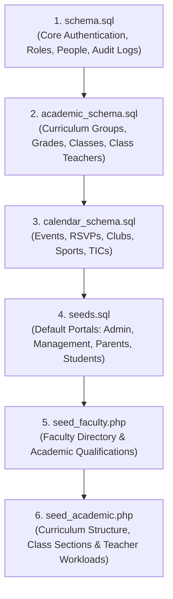

# L'École — Database Setup & Seed Guide

This document defines the **exact execution order** and commands required to set up the L'École relational database from scratch on a clean MySQL 8.0+ or MariaDB 10.5+ instance.

---

## Database Connection Details

| Property | Default Value | Docker Environment |
| :--- | :--- | :--- |
| **Database Name** | `l_ecole` | `l_ecole` |
| **User** | `root` | `root` |
| **Password** | `root` | `root` |
| **Host** | `127.0.0.1` | `db` (internal) / `localhost:3307` (host) |
| **Port** | `3306` (or `3307`) | `3306` (container) / `3307` (host mapping) |
| **Collation** | `utf8mb4_unicode_ci` | `utf8mb4_unicode_ci` |

---

## Execution Order Overview

Because of foreign key constraints between roles, academic classes, faculty, and extracurriculars, the schema and seed scripts **MUST be executed in this exact sequence**:



### Why this order matters:
1. **`schema.sql`** defines the foundational tables: `user_accounts`, `teachers`, `students`, `parents`, `management_profiles`, `admin_profiles`, `student_parents`, and `activity_logs`.
2. **`academic_schema.sql`** creates the academic hierarchy (`curriculum_groups`, `grades`, `classes`) and assigns foreign keys from `class_teachers` and `class_subject_teachers` referencing `teachers(id)`. It also alters `students` to link `class_id` to `classes(id)`.
3. **`calendar_schema.sql`** creates extracurricular and event structures (`calendar_events`, `clubs`, `sports`, `club_teachers`, `sport_teachers`) which have foreign keys referencing both `teachers(id)` and `students(id)`.
4. **`seeds.sql`** inserts starter accounts and profile rows for all roles.
5. **`seed_faculty.php`** populates the full faculty member list and qualifications in `teachers` and `teacher_qualifications`.
6. **`seed_academic.php`** maps classes, class teachers, and subject teachers. This relies on the faculty members already existing in `teachers`.

---

## Option A: Setup via Docker (Recommended)

If you are running the project via Docker Compose (`mvc-db-1` and `mvc-php-1` containers):

```bash
# 1. Create database (if not already created)
docker exec -i mvc-db-1 mysql -u root -proot -e "CREATE DATABASE IF NOT EXISTS l_ecole CHARACTER SET utf8mb4 COLLATE utf8mb4_unicode_ci;"

# 2. Run Core Schema
docker exec -i mvc-db-1 mysql -u root -proot l_ecole < database/schema.sql

# 3. Run Academic Schema
docker exec -i mvc-db-1 mysql -u root -proot l_ecole < database/academic_schema.sql

# 4. Run Calendar & Extracurricular Schema
docker exec -i mvc-db-1 mysql -u root -proot l_ecole < database/calendar_schema.sql

# 5. Run Base Account Seeds
docker exec -i mvc-db-1 mysql -u root -proot l_ecole < database/seeds.sql

# 6. Seed Faculty & Qualifications
docker exec -i mvc-php-1 php /var/www/html/database/seed_faculty.php

# 7. Seed Academic Classes & Subject Teachers
docker exec -i mvc-php-1 php /var/www/html/database/seed_academic.php
```

### Single-Command Docker Shortcut:

From the `MVC/` project directory:

```bash
docker exec -i mvc-db-1 mysql -u root -proot -e "CREATE DATABASE IF NOT EXISTS l_ecole CHARACTER SET utf8mb4 COLLATE utf8mb4_unicode_ci;" && \
docker exec -i mvc-db-1 mysql -u root -proot l_ecole < database/schema.sql && \
docker exec -i mvc-db-1 mysql -u root -proot l_ecole < database/academic_schema.sql && \
docker exec -i mvc-db-1 mysql -u root -proot l_ecole < database/calendar_schema.sql && \
docker exec -i mvc-db-1 mysql -u root -proot l_ecole < database/seeds.sql && \
docker exec -i mvc-php-1 php /var/www/html/database/seed_faculty.php && \
docker exec -i mvc-php-1 php /var/www/html/database/seed_academic.php
```

### Windows PowerShell Docker Commands:

On Windows PowerShell, piping via `Get-Content` is used instead of `<`:

```powershell
docker exec -i mvc-db-1 mysql -u root -proot -e "CREATE DATABASE IF NOT EXISTS l_ecole CHARACTER SET utf8mb4 COLLATE utf8mb4_unicode_ci;"
Get-Content database\schema.sql | docker exec -i mvc-db-1 mysql -u root -proot l_ecole
Get-Content database\academic_schema.sql | docker exec -i mvc-db-1 mysql -u root -proot l_ecole
Get-Content database\calendar_schema.sql | docker exec -i mvc-db-1 mysql -u root -proot l_ecole
Get-Content database\seeds.sql | docker exec -i mvc-db-1 mysql -u root -proot l_ecole
docker exec -i mvc-php-1 php /var/www/html/database/seed_faculty.php
docker exec -i mvc-php-1 php /var/www/html/database/seed_academic.php
```

---

## Option B: Setup on Local Host (Native MySQL + PHP)

If running directly on your host machine without Docker:

```bash
# Set your MySQL credentials (adjust user/pass/port as needed)
DB_USER="root"
DB_PASS="root"
DB_NAME="l_ecole"
DB_PORT="3306" # or 3307

# 1. Create the database
mysql -u $DB_USER -p$DB_PASS -P $DB_PORT -e "CREATE DATABASE IF NOT EXISTS $DB_NAME CHARACTER SET utf8mb4 COLLATE utf8mb4_unicode_ci;"

# 2. Step 1: Core Schema
mysql -u $DB_USER -p$DB_PASS -P $DB_PORT $DB_NAME < database/schema.sql

# 3. Step 2: Academic Schema
mysql -u $DB_USER -p$DB_PASS -P $DB_PORT $DB_NAME < database/academic_schema.sql

# 4. Step 3: Calendar & Extracurricular Schema
mysql -u $DB_USER -p$DB_PASS -P $DB_PORT $DB_NAME < database/calendar_schema.sql

# 5. Step 4: Base Account Seeds
mysql -u $DB_USER -p$DB_PASS -P $DB_PORT $DB_NAME < database/seeds.sql

# 6. Step 5: Faculty Seed Script
php database/seed_faculty.php

# 7. Step 6: Academic Classes & Teacher Workload Seed Script
php database/seed_academic.php
```

---

## Migrations (For Existing Databases)

If you are updating an existing database rather than performing a fresh install, run the incremental migration files located in `database/migrations/`:

```bash
# In Docker:
docker exec -i mvc-db-1 mysql -u root -proot l_ecole < database/migrations/001_link_students_to_classes.sql
docker exec -i mvc-db-1 mysql -u root -proot l_ecole < database/migrations/002_enforce_teacher_fk_in_class_teachers.sql

# Or on Local MySQL:
mysql -u root -proot l_ecole < database/migrations/001_link_students_to_classes.sql
mysql -u root -proot l_ecole < database/migrations/002_enforce_teacher_fk_in_class_teachers.sql
```

*(Note: Fresh installations using the 3 schema files above already include these constraints).*

---

## Verification & Sanity Checks

Verify the database setup by running:

```bash
# Check all created tables (should list ~25 tables)
docker exec -i mvc-db-1 mysql -u root -proot l_ecole -e "SHOW TABLES;"

# Test console tool and inspect locked accounts
docker exec -i mvc-php-1 php /var/www/html/console.php list-locked

# View recent system audit events
docker exec -i mvc-php-1 php /var/www/html/console.php logs 10
```

---

## Default Seed Credentials

All pre-seeded test accounts share the default password: **`Password@123`**

| Role | Portal URL | Seed Identifier / Email | Password |
| :--- | :--- | :--- | :--- |
| **Administrator** | `/auth/admin` | `david_silva_admin@lecole.edu` | `Password@123` |
| **Management** | `/auth/management` | `sarah_vance@lecole.edu` | `Password@123` |
| **Teacher** | `/auth/teacher` | `alex_benjamin@lecole.edu` | `Password@123` |
| **Teacher** | `/auth/teacher` | `james_wilson@lecole.edu` | `Password@123` |
| **Student** | `/auth/student` | `STU-2026-0001` (or `2026/0001`) | `Password@123` |
| **Parent** | `/auth/parent` | `elena.peiris@gmail.com` | `Password@123` |
